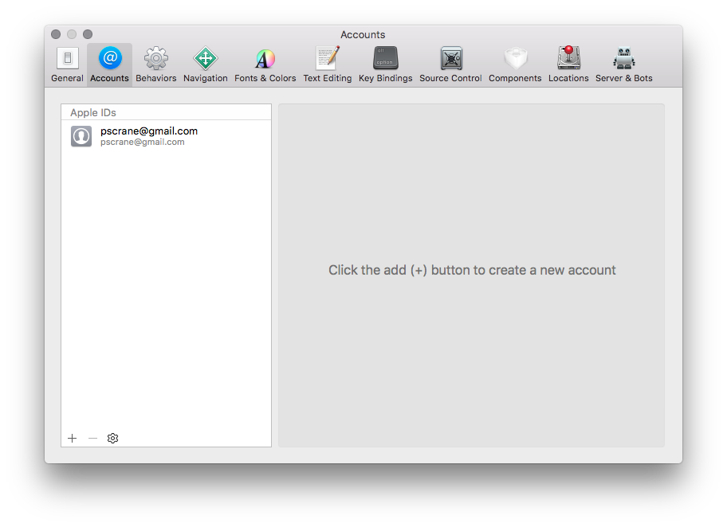
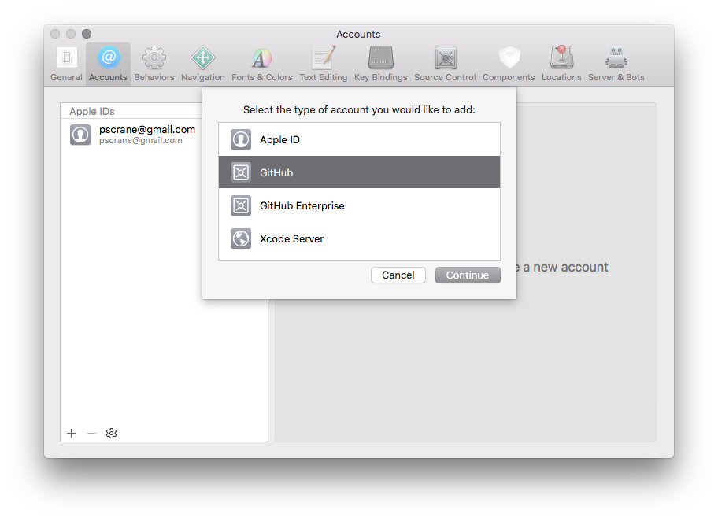
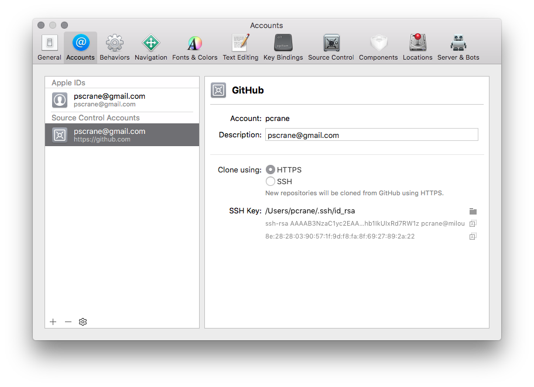
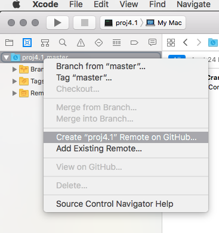
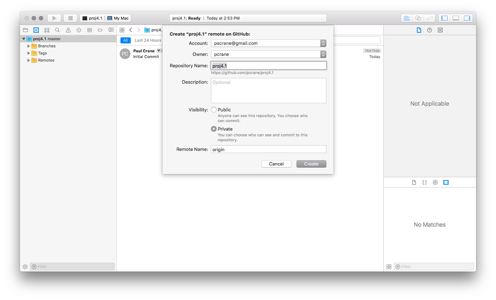
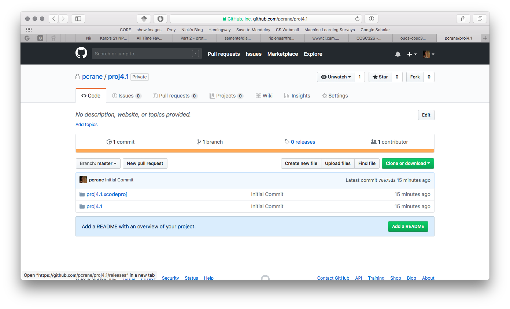

# Week 4 Inheritance and Composition

This file contains a summary of the information in lab04.html.  That file contains the lab 
instructions and should be opened in a browser so you can see all the images.

In this lab we will: 
* Practise using git
* Implement a container library using inheritance
* Implement a container library using composition

As you go through the lab, practise good git commit practises (with sensible commit messages).

In this lab, we're going to explore the IDE integration with git (I know that
some/most of you may have already done this, but I'll add some guidance for
those that haven't).

Xcode (and many other IDEs) have an inbuilt git client. For this lab, we're
going to let Xcode create a repository for the project on GitHub for us. Go to
the Xcode Preferences and find the Accounts tab. 

Click on the 'plus' button in the bottom left, and select GitHub account (and
**not** the Enterprise option).  Sign into your GitHub account and follow the
steps.

Now, when you create a new project make sure the 'Create Git repo' is ticked.
This will initialise a new git repository on your local machine and allow you
to track the changes as you need to. 

To link it to your GitHub account, select the source control icon in the
navigation area. 

Right click on your project and select 'Create ... remote on GitHub' and follow
the prompts (I'd make it a private repo).

Once this is done, you should see the project in your GitHub account.

